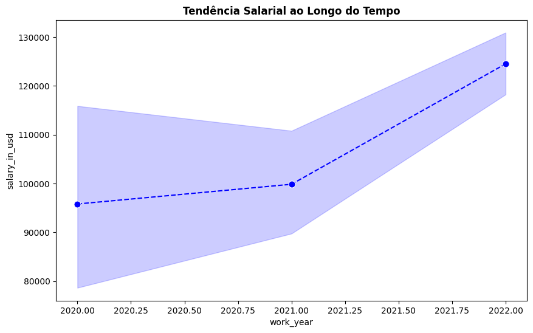
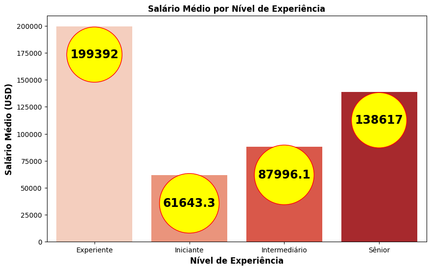
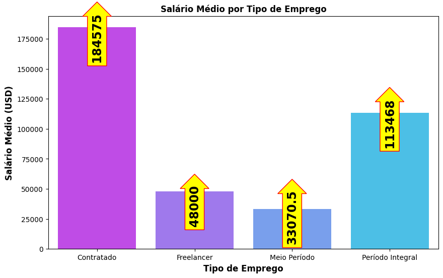
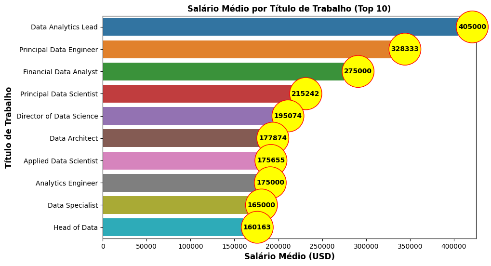
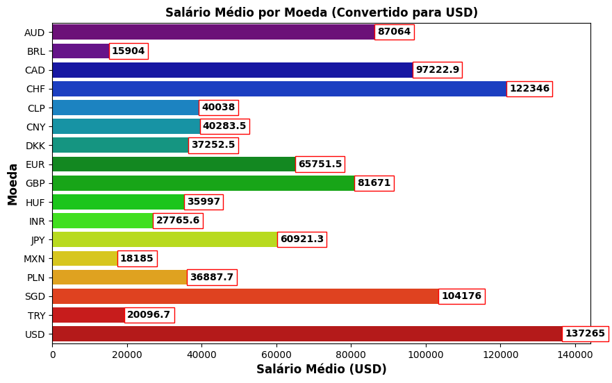
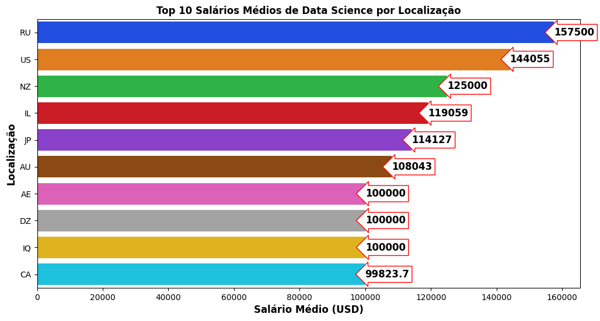
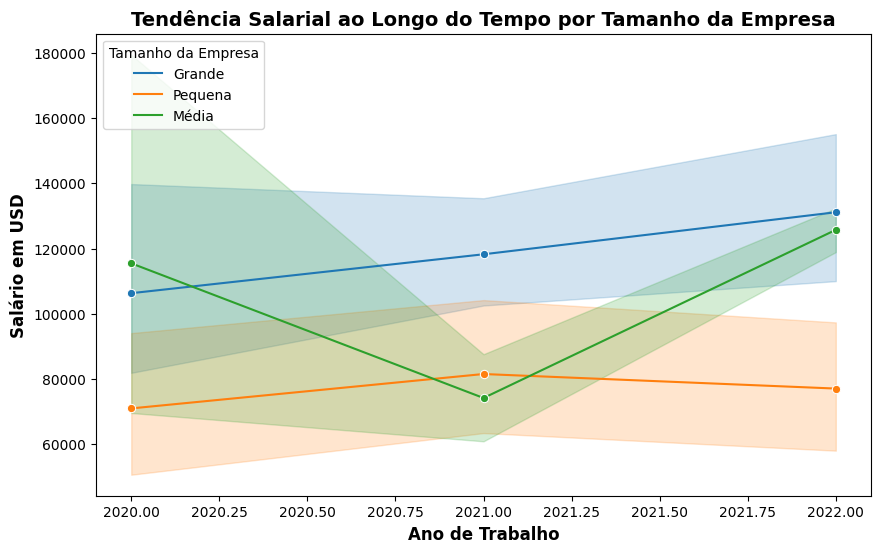
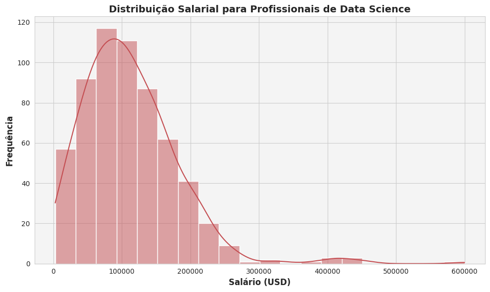
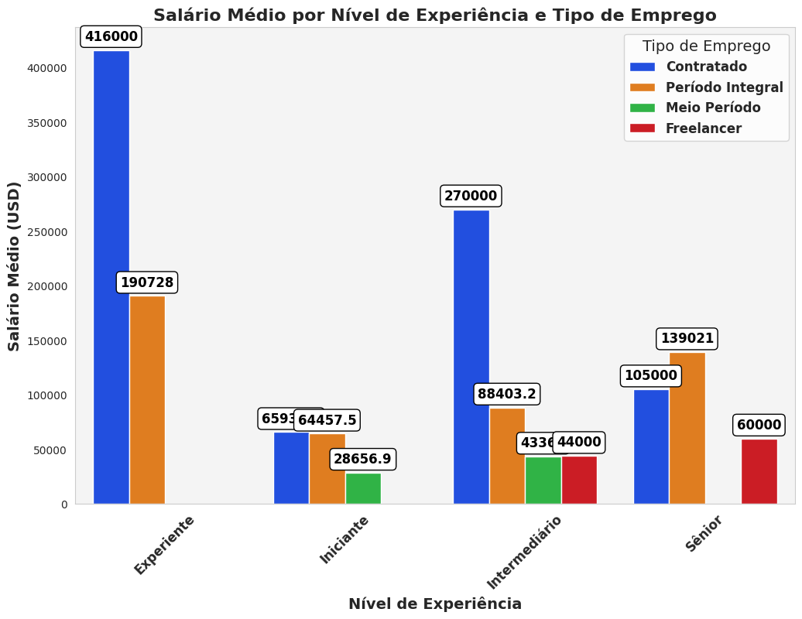

# Relatório do Projeto de Data Science

## Tema do Projeto
O projeto analisa dados salariais de profissionais de Data Science, explorando tendências, padrões e fatores influenciadores nos salários. 

## GitHub Repository
O código fonte e outros arquivos do projeto podem ser encontrados no repositório GitHub [Data_Science_project](https://github.com/Mateus-magarinus/Data_Science_project).

## Dataset Utilizado
### Origem
O conjunto de dados foi obtido de [Nome da Fonte do Dados] e consiste em informações salariais de profissionais de Data Science.

### Variáveis
O dataset possui as seguintes variáveis:
- `work_year`: O ano em que o salário foi pago.
- `experience_level`: O nível de experiência no trabalho.
- `employment_type`: O tipo de emprego (tempo integral, meio período, etc.).
- `job_title`: O título do cargo.
- `salary`: O salário total bruto.
- `salary_currency`: A moeda do salário.
- `salary_in_usd`: O salário em USD (taxa de câmbio ajustada).
- `employee_residence`: O país de residência do funcionário.
- `remote_ratio`: A quantidade de trabalho remoto.
- `company_location`: O país da sede ou filial da empresa.
- `company_size`: O tamanho médio da empresa.

### Transformações
Para melhorar a compreensão e interpretação dos dados, foram realizadas as seguintes transformações no dataset:

#### Substituição de Valores
- Na coluna `experience_level`, os códigos foram substituídos pelos seguintes rótulos: 'EN' por 'Iniciante', 'EX' por 'Experiente', 'MI' por 'Intermediário' e 'SE' por 'Sênior'.
- Na coluna `employment_type`, os códigos foram substituídos por: 'FT' por 'Período Integral', 'CT' por 'Contratado', 'FL' por 'Freelancer' e 'PT' por 'Meio Período'.
- Na coluna `company_size`, os códigos foram substituídos por: 'L' por 'Grande', 'M' por 'Média' e 'S' por 'Pequena'.

### Visualização Temporal

A análise temporal foi fundamental para compreender a evolução dos salários ao longo dos anos. A visualização temporal foi realizada por meio de gráficos de linha, onde o eixo x representa o ano de trabalho e o eixo y o salário em USD. Essa abordagem permitiu identificar tendências, flutuações e padrões de comportamento nos salários ao longo do tempo.

Essa análise também ajudou a destacar possíveis impactos de eventos externos, como mudanças econômicas globais ou tendências específicas da indústria de Data Science. Por exemplo, pode-se observar se houve um aumento salarial consistente ao longo dos anos ou se certos anos apresentaram variações significativas.

### Análise Exploratória

A análise exploratória foi conduzida para entender a distribuição dos salários em diferentes categorias e identificar padrões específicos nos dados. Algumas das análises exploratórias incluíram:

#### Distribuição de Salários por Nível de Experiência
Um gráfico de barras foi utilizado para visualizar a média salarial em relação aos diferentes níveis de experiência. Isso proporcionou insights sobre como os salários variam entre profissionais de diferentes níveis, destacando se existe uma correlação clara entre experiência e remuneração.

#### Distribuição de Salários por Tipo de Emprego
Outra análise envolveu a distribuição de salários com base no tipo de emprego (tempo integral, meio período, etc.). Isso ajudou a entender se há diferenças significativas nas remunerações entre diferentes modalidades de emprego.

#### Distribuição de Salários por Tamanho da Empresa
A média salarial foi analisada em relação ao tamanho médio da empresa, categorizado como pequena, média ou grande. Essa análise permitiu identificar se o tamanho da empresa influencia a remuneração dos profissionais de Data Science.

#### Distribuição de Salários por Cargo (Top 10)
Um gráfico de barras foi utilizado para mostrar a média salarial dos 10 principais cargos. Isso proporcionou uma visão clara das remunerações associadas a funções específicas no campo de Data Science.

## Resultados
### Tendência Salarial
Durante o período de 2020 a 2021, não houve uma mudança significativa nos salários.
Observou-se mudanças contínuas nos salários de 2021 a 2022.

### Análise por Nível de Experiência
Profissionais experientes recebem o salário médio mais alto, aproximadamente 199.392 USD.
Os profissionais sêniores também recebem um salário médio competitivo, cerca de 138.617 USD.
Funcionários de nível intermediário têm um salário médio em torno de 87.996,1 USD.
Posições de nível inicial oferecem um salário médio mais baixo, aproximadamente 61.643,3 USD.

### Análise por Tipo de Emprego
Funcionários em período integral têm o segundo salário médio mais alto, aproximadamente 113.468 USD.
Contratados também recebem o maior salário médio, cerca de 184.575 USD.
Freelancers e trabalhadores em meio período têm salários médios mais baixos, em torno de 33.070,5 USD e 48.000 USD, respectivamente.

### Análise por Título de Trabalho
O Data Analytics Lead tem o salário médio mais alto, de 405.000 USD.
Principal Data Enginner e Financial Data Analyst também têm salários notavelmente elevados.
Os dez principais títulos de trabalho apresentam um forte potencial de ganho no campo da ciência de dados.

### Análise por Moeda
Os funcionários que recebem salários em USD têm o salário médio mais alto, aproximadamente 137.265 USD.

Os salários em CHF (Franco Suíço) estão como segundo mais alto, com uma média de 122.346 USD.

Outras moedas variam em salários médios, com MXN (Peso Mexicano) e BRL (Real Brasileiro) estando entre os mais baixos.

 

### Análise por Localização da Empresa
Rússia (RU), possui o salário médio em ciência de dados mais alto, aproximadamente 157.500 USD.
Estados Unidos (US) e Nova Zelândia (NZ) também oferecem salários médios competitivos, com cerca de 144.055 USD e 125.000 USD, respectivamente.
Illinois (IL) e Japão (JP) têm salários médios em ciência de dados de cerca de 119.059 USD e 114.127 USD, respectivamente.

### Análise por Tamanho da Empresa
A tendência salarial em empresas de porte médio está aumentando em comparação com empresas pequenas e grandes.
A linha salarial em grandes empresas não está flutuando tanto quanto em empresas de porte médio.

### Distribuição Salarial
A distribuição salarial para profissionais de ciência de dados é assimétrica à direita, com a maioria dos profissionais ganhando salários na faixa de baixo a médio.
Um pico perceptível na distribuição sugere uma concentração de profissionais dentro de uma faixa salarial específica.
A curva KDE (Kernel Density Estimate) fornece uma estimativa suave da distribuição, mostrando um pico proeminente.

### Média Salarial por Nível de Experiência e Título de Cargo

##### Melhor Tipo de Emprego e Nível de Experiência para Máxima Eficiência de Custo:
  - Nível de Experiência: Experiente
  - Tipo de Emprego: Contratado
  - Salário Médio (USD): 416.000,0
  

## Conclusões
Este relatório oferece uma visão geral do projeto, suas fontes de dados, transformações aplicadas e os principais resultados encontrados. Os insights obtidos destacam a importância da experiência, tipo de emprego, título de trabalho, moeda e localização da empresa na determinação dos salários em Data Science. Possíveis direções futuras incluem a expansão da análise para considerar fatores adicionais e aprimorar os modelos de previsão para uma compreensão mais profunda dos padrões salariais. O código fonte completo e os detalhes podem ser encontrados no repositório GitHub [Data_Science_project](https://github.com/Mateus-magarinus/Data_Science_project).

